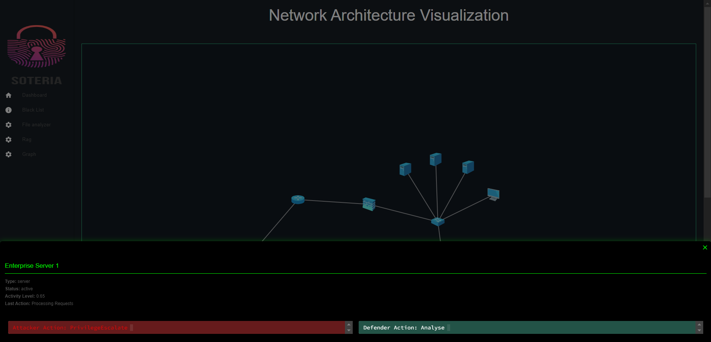
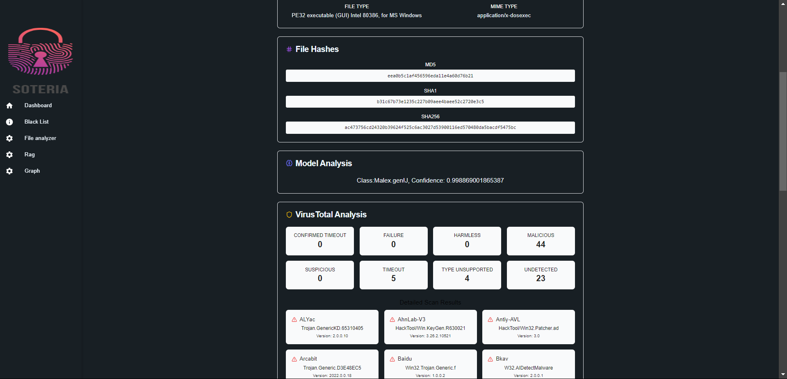
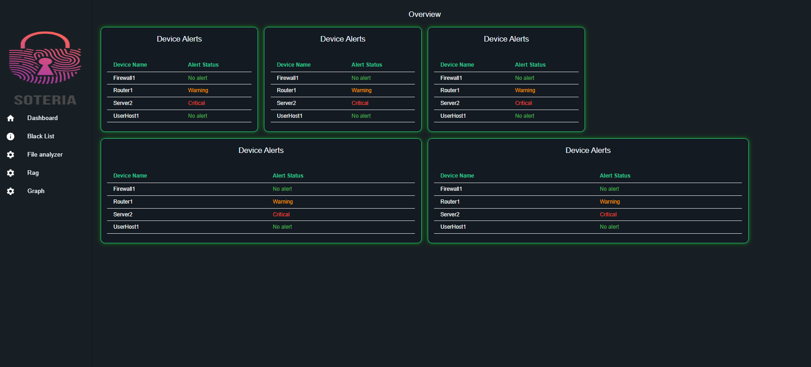
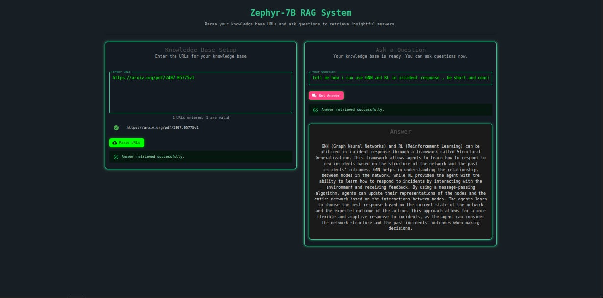
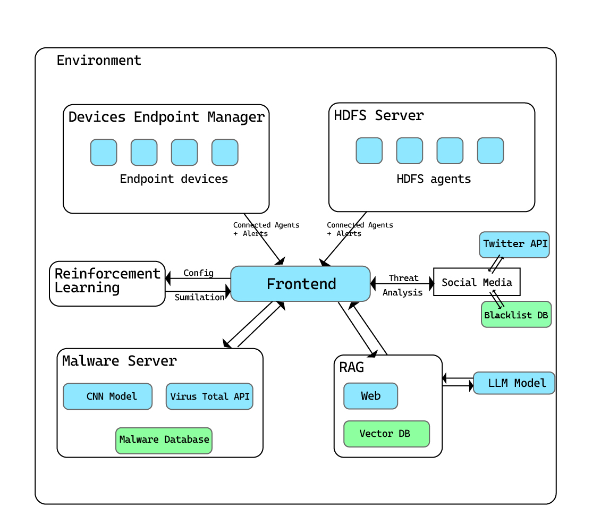

## Features


<a name="readme-top"></a>
<div align="center">

[![Contributors][contributors-shield]][contributors-url]
[![Forks][forks-shield]][forks-url]
[![Stargazers][stars-shield]][stars-url]
[![Issues][issues-shield]][issues-url]
[![MIT License][license-shield]][license-url]
[![LinkedIn][linkedin-shield]](https://www.linkedin.com/in/chater-marzougui-342125299/)
</div>

<!-- PROJECT LOGO -->
<br />
<div align="center">
  <a href="https://github.com/ghassen-fatnassi/CS_TUN56">
    
  </a>
    <h1 width="35px">Soteria</h1>
  <p align="center">
    A Comprehensive Cybersecurity Solution with Multiple Analysis Components
    <br />
    <br />
    <a href="https://github.com/ghassen-fatnassi/CS_TUN56/issues/new?labels=bug&template=bug-report---.md">Report Bug</a>
    ·
    <a href="https://github.com/ghassen-fatnassi/CS_TUN56/issues/new?labels=enhancement&template=feature-request---.md">Request Feature</a>
  </p>
</div>

<!-- TABLE OF CONTENTS -->
<details>
  <summary>Table of Contents</summary>
  <ol>
    <li><a href="#about-the-project">About The Project</a></li>
    <li><a href="#features">Features</a></li>
    <li><a href="#installation">Installation</a></li>
    <li><a href="#usage">Usage</a></li>
    <li><a href="#contributing">Contributing</a></li>
    <li><a href="#credits">Credits</a></li>
    <li><a href="#license">License</a></li>
  </ol>
</details>

<!-- ABOUT THE PROJECT -->
## About The Project

**Soteria** is an advanced cybersecurity system designed to tackle modern cyber threats using a suite of models and tools. Built with scalability in mind, Soteria is structured as a microservices-based platform that combines reinforcement learning, social media parsing, malware analysis, anomaly detection, traffic logging, and a retrieval-augmented generation (RAG) model. This enables Soteria to address a wide variety of cybersecurity challenges in real time.

<p align="right">(<a href="#readme-top">back to top</a>)</p>

## Features

Our system, **Soteria**, is an innovative, multi-layered cybersecurity solution designed to address various types of cyber threats. It is structured as a microservices-based platform, allowing for scalability and modularity. Here’s a detailed breakdown of each component:

1. **Reinforcement Learning Agent**:
   - **Environment**: Utilizes the CAGE environment to simulate various cybersecurity scenarios.
   - **Graph Neural Network (GNN)**: Integrates a GNN to store and track the system status, enabling communication of critical states. This novel approach allows us to train the agent across multiple scenarios without losing accuracy.
   - **Training Flexibility**: By using this model, the agent can operate under different variations of scenarios, allowing for efficient and robust training.

   <div align="center" width="800">
     
   </div>

2. **Twitter Parsing and Threat Detection**:
   - **Threat Analysis**: A logistic regression classifier, combined with a "cyner" instance, assesses threat levels in tweets.
   - **Blacklist Monitoring**: Soteria can monitor specified blacklisted user IDs in real time, flagging tweets that indicate potential threats.

3. **Malware Analysis Tool**:
   - **Static Analysis**: Transforms binary data of files into images, which are analyzed using a Convolutional Neural Network (CNN). This method has shown exceptional performance in detecting malware.
   - **Dynamic Analysis**: Utilizes the VirusTotal API to perform dynamic analysis on suspected files, enhancing the system’s capability to identify malicious behavior.

   <div align="center" width="800">
     
   </div>

4. **HDFS Anomaly Detection**:
   - **Log Collection**: Multiple agents gather logs from HDFS servers and send them to a centralized manager.
   - **LSTM Model with Deviation Layer**: Uses an LSTM model with a deviation layer for accurate real-time anomaly detection, feeding results directly into the frontend.

5. **Traffic Logging Agent**:
   - **Data Collection**: Employs CICFlowMeter to collect traffic data from endpoints.
   - **Voting System**: Utilizes an XGBoost/Random Forest voting system to make predictions on traffic data. This ensures a more accurate threat assessment and forwards the processed data to the frontend.

   <div align="center" width="800">
     
   </div>

6. **Zephyr 7B Retrieval-Augmented Generation (RAG) Model**:
   - **Document Parsing**: Capable of parsing research papers, logs, and external reports from URLs.
   - **Contextual Question-Answering**: The RAG model can answer queries based on contextual understanding, enhancing the system’s response capability to complex cybersecurity questions.
   
   <div align="center" width="800">
     
   </div>

7. **Comprehensive Frontend**:
   - **User Interface**: Built with React, the frontend displays all relevant data and analytics in a user-friendly interface.
   - **Microservices Architecture**: Each component of Soteria is containerized, allowing for individual deployment, scalability, and fault isolation. Docker Compose manages the orchestration for seamless operation.

   <div align="center" width="800">
     
   </div>

<p align="right">(<a href="#readme-top">back to top</a>)</p>

## System Overview

**Soteria** consists of several interconnected components:

- **Reinforcement Learning Agent**: Built on the CAGE environment and a Graph Neural Network (GNN) for robust, scenario-based training.
- **Twitter Parsing and Threat Detection**: A logistic regression model, paired with a threat-detection instance, flags dangerous tweets.
- **Malware Analysis Tool**: Combines static analysis (CNN-based image representation) and dynamic analysis (VirusTotal API) for effective malware detection.
- **HDFS Anomaly Detection**: Agents collect logs from HDFS, which are fed into an LSTM model with deviation layers for real-time anomaly alerts.
- **Traffic Logging Agent**: Collects traffic data via CICFlowMeter and uses an XGBoost/Random Forest voting system for accurate predictions.
- **Zephyr 7B RAG Model**: Parses documents and logs, answering cybersecurity questions with contextual understanding.
- **Frontend**: A React-based interface that displays all analytics, threats, and logs in real-time.

This architecture allows **Soteria** to easily integrate with other cybersecurity tools such as **Suricata**, **Wazuh**, and **Filebeat**, enhancing log collection and anomaly detection capabilities. During our tests, we used mock data and connected **Soteria** to virtual machines to simulate cybersecurity attacks and assess its effectiveness.

<p align="right">(<a href="#readme-top">back to top</a>)</p>

## Additional Resources

The repository includes:

- **Pretrained Models**: For each module.
- **Pipelines**: For easy deployment and integration.
- **Docker Configurations**: For containerizing and orchestrating all components.
- **Training Notebooks**: For reproducing model training and performance assessments.

<p align="right">(<a href="#readme-top">back to top</a>)</p>

## Frontend Installation Guide

The frontend of Soteria is built with **React**, **TypeScript**, and **Vite**. Follow these steps to set it up locally:

### Prerequisites

1. **Node.js**: Ensure you have Node.js installed (version 16 or higher is recommended).
   - You can download it from [Node.js official website](https://nodejs.org/).

2. **Package Manager**: You can use either **npm** (comes with Node.js) or **yarn**.

## Frontend Setup Instructions

### Steps

1. **Clone the Repository**:
   ```bash
   git clone https://github.com/ghassen-fatnassi/CS_TUN56
   ```

2. **Navigate to the Frontend Directory**:
   ```bash
   cd CS_TUN56/frontend
   ```

3. **Install Dependencies**:
   * If you're using npm:
     ```bash
     npm install
     ```
   * If you're using yarn:
     ```bash
     yarn install
     ```

4. **Configure Environment Variables**:
   * Create a `.env` file in the `frontend` directory
   * Add the following variables, adjusting as needed:
     ```plaintext
     VITE_API_URL=http://localhost:5000 # URL for your backend API
     ```

5. **Start the Development Server**:
   * If you're using npm:
     ```bash
     npm run dev
     ```
   * If you're using yarn:
     ```bash
     yarn dev
     ```

6. **Access the Frontend**:
   * The development server should start on `http://localhost:5173` by default
   * Open this URL in your browser to view the frontend

<p align="right">(<a href="#readme-top">back to top</a>)</p>

## Usage

1. Deploy the Soteria system using Docker Compose.
2. Access the React-based frontend to monitor system status and analytics.
3. For demonstration, preloaded mock data can be fed into the models to observe functionality.
4. Logs and alerts will display in real time, with threat levels, anomalies, and other cybersecurity events highlighted.

<p align="right">(<a href="#readme-top">back to top</a>)</p>

## Contributing

We welcome contributions to improve Soteria! Please fork the repository and create a pull request for any new features or fixes. Contributions can also be submitted as issues.

1. Fork the Project
2. Create your Feature Branch (`git checkout -b feature/AmazingFeature`)
3. Commit your Changes (`git commit -m 'Add some AmazingFeature'`)
4. Push to the Branch (`git push origin feature/AmazingFeature`)
5. Open a Pull Request

<p align="right">(<a href="#readme-top">back to top</a>)</p>

## Credits

Soteria was created by 
**Mohamed Aziz Badri Khadhraoui**
**Ghassen Fatnassi**
**Mohamed Kaouech**
**Sahar Guebsi**
**Chater Marzougui**
**Fatma Ezzahra ben Helal** 
and other IEEE SUP'COM Student branch collaborators for the TSYP 2056 CS challenge.

<p align="right">(<a href="#readme-top">back to top</a>)</p>

## License

This project is licensed under the [MIT License](LICENSE).

<p align="right">(<a href="#readme-top">back to top</a>)</p>


<!-- MARKDOWN LINKS & IMAGES -->
[contributors-shield]: https://img.shields.io/github/contributors/ghassen-fatnassi/CS_TUN56.svg?style=for-the-badge
[contributors-url]: https://github.com/ghassen-fatnassi/CS_TUN56/graphs/contributors
[forks-shield]: https://img.shields.io/github/forks/ghassen-fatnassi/CS_TUN56.svg?style=for-the-badge
[forks-url]: https://github.com/ghassen-fatnassi/CS_TUN56/network/members
[stars-shield]: https://img.shields.io/github/stars/ghassen-fatnassi/CS_TUN56.svg?style=for-the-badge
[stars-url]: https://github.com/ghassen-fatnassi/CS_TUN56/stargazers
[issues-shield]: https://img.shields.io/github/issues/ghassen-fatnassi/CS_TUN56.svg?style=for-the-badge
[issues-url]: https://github.com/ghassen-fatnassi/CS_TUN56/issues
[license-shield]: https://img.shields.io/github/license/ghassen-fatnassi/CS_TUN56.svg?style=for-the-badge
[license-url]: https://github.com/ghassen-fatnassi/CS_TUN56/blob/master/LICENSE.txt
[linkedin-shield]: https://img.shields.io/badge/-LinkedIn-black.svg?style=for-the-badge&logo=linkedin&colorB=555
[linkedin-url]: https://linkedin.com/in/chater-marzougui-342125299
